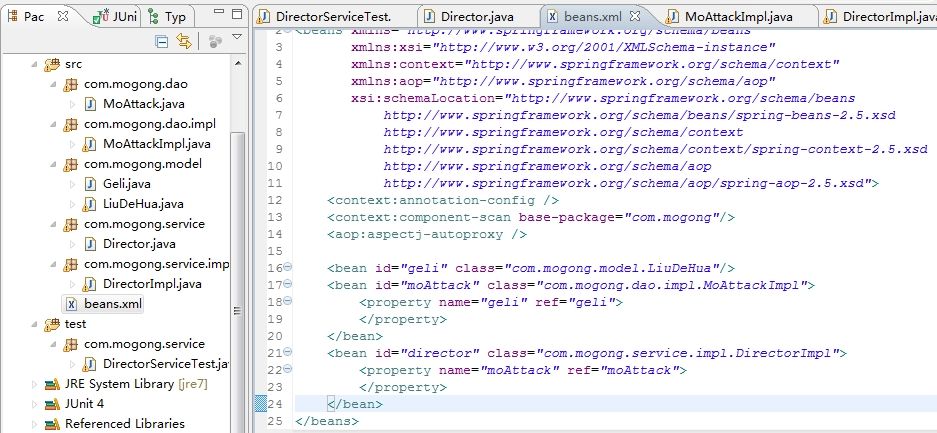
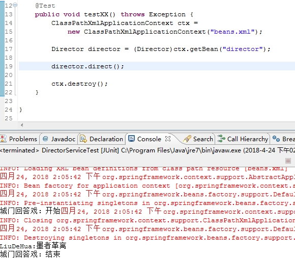

主要是理解Spring IOC( Inversion of Control)/DI(Dependency Injection)

ioc的优点：

资源不是由资源的使用者管理，而是由不使用资源的第三方管理，这可以带来很多好处
* 第一，资源集中管理，实现资源的可配置和易管理。
* 第二，降低了使用资源方的依赖程度，也就是我们说的耦合度。

---

《墨攻》中剧本是：

革离（刘德华饰演）到达梁国城门口。

守城士兵问：“来着何人”

革离回答：“墨者革离” 

-----

对人物，剧本的抽象

角色是革离，具体的演员很多（比如：先找演员试演），其中一个来试演的是刘德华

```java

public class Geli {
    // 有一个回答士兵的方法
	public void responseAsk(String content){
		System.out.println(content);
	}
}


public class LiuDeHua extends Geli{
	
	public void responseAsk(String content){
		System.out.println("回答:" + content);
	}
	
}
```

事件是： 城门口回复士兵的话“来者何人”

```java
public interface MoAttack {
	void cityGateAsk();
}
```

----

* 剧本设计 1 

```java
public class MoAttackImpl_1 implements MoAttack {

	@Override
	public void cityGateAsk() {
		
		// 1 具体的演员直接侵入剧本
		LiuDeHua concrete_actor = new LiuDeHua();
		
		concrete_actor.responseAsk("墨者革离！");
	}

}
```

* 剧本设计 2

```java
public class MoAttackImpl_2 implements MoAttack {

	@Override
	public void cityGateAsk() {
		
		// 2 引进角色Geli, 自己定义具体的角色
		Geli geli = new LiuDeHua();
		
		geli.responseAsk("墨者革离！");
	}

}
```


* 剧本设计 3

```java
public class MoAttackImpl_3 implements MoAttack {

	private Geli geli;
	
	@Override
	public void cityGateAsk() {		
		geli.responseAsk("墨者革离！");
	}

	public Geli getGeli() {
		return geli;
	}

	// 3 角色演员是不确定的,由导演来指定
	public void setGeli(Geli geli) {
		this.geli = geli;
	}

}
```


剧本3中， 需要革离出现时，设置一下，并且具体有谁来演，可以**注入**进来，然后调用其对应的属性方法。

----

所以最后可以如下设计：

```java
public interface ActorArrangable {
	  void injectGeli(Geli geli);  
}


public class MoAttack implements ActorArrangable{

	private Geli geli;  
	 
	@Override
	public void injectGeli(Geli geli) {
		this.geli = geli;
	}
	
	public void cityGateAsk() {  
        	geli.responseAsk("墨者革离");  
    	}  
}

public class Director {
	
	public void direct(){  
		// 1 指定角色的扮演者  
	       Geli geli = new LiuDeHua();    

		// 2 注入具体扮演者
	       MoAttack moAttack = new MoAttack();
	       moAttack.injectGeli(geli);

	       // 3 人物剧本执行
	       moAttack.cityGateAsk();
   	}  
	
}
```

MoAttack 与 LiuDeHua 实现了解耦，即 MoAttack 不需要关注 角色 Geli 的实现类的实例化工作，实现好自己的逻辑就行了，但是这些实例化工作仍然存在，只是交给了 Director 类。(Inversion of Control, 控制反转)

加入一个制片人在选定剧本后，想通过第三方机构确定:演员，导演（导演也可以选择），能够实现 剧本，演员，导演，三者的全部解耦。

----

上述的第三方机构就是Spring 容器，各种关系交给Spring 容器来管理，自动完成类的初始化和依赖注入（DI）。如下图所示

```java
<bean id="geli" class="com.mogong.model.impl.LiuDeHua"/>

<bean id="moAttack" class="com.mogong.dao.impl.MoAttackImpl">
    <property name="geli" ref="geli">
    </property>
</bean>

<bean id="director" class="com.mogong.service.impl.DirectorImpl">
    <property name="moAttack" ref="moAttack">
    </property>
</bean>
```

目录以及运行图如下





----

参考:

作者：jinnianshilongnian
http://jinnianshilongnian.iteye.com/blog/1413846

谈谈对Spring IOC的理解
https://blog.csdn.net/qq_22654611/article/details/52606960/
